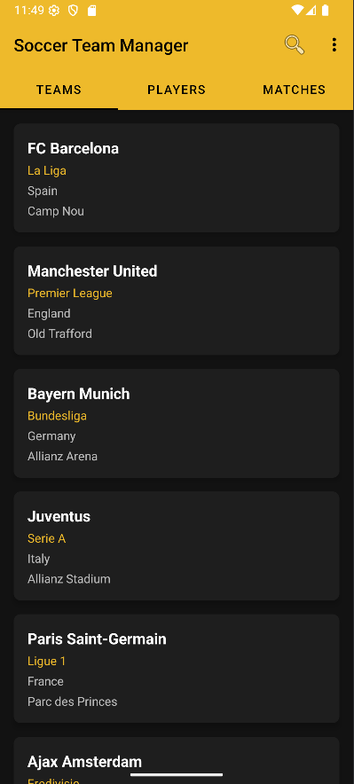

# Soccer Team Manager

A modern Android application demonstrating clean architecture, efficient data management, and best practices in Android development. The app manages soccer teams, players, and matches with advanced filtering, sorting, and search capabilities.



## Features

### Data Management
- **Teams**: Manage soccer teams with details like name, league, country, and founding year
- **Players**: Track player information including name, position, team, age, and jersey number
- **Matches**: Record match details with teams, scores, competition, and venue

### Advanced Filtering System
Each section implements sophisticated filtering:

#### Teams
- All Teams
- European Leagues
- American Leagues
- Historic Teams (Founded before 1900)

#### Players
- Position-based (Forwards, Midfielders, Defenders, Goalkeepers)
- Age-based (Young Talents ≤23, Experienced ≥30)
- All Players view

#### Matches
- Competition type (Champions League, Domestic Leagues)
- Score-based (High Scoring matches with 3+ goals)
- Result-based (Draws)

### Sorting Capabilities
Each entity supports multiple sorting criteria:

#### Teams
```java
switch (currentSortOption) {
    case NAME: comparator = Comparator.comparing(Team::getName);
    case LEAGUE: comparator = Comparator.comparing(Team::getLeague);
    case COUNTRY: comparator = Comparator.comparing(Team::getCountry);
    case FOUNDED_YEAR: comparator = Comparator.comparing(Team::getFoundedYear);
}
```

#### Players
- Name
- Team
- Age
- Jersey Number

#### Matches
- Date
- Competition
- Home/Away Team

## Technical Implementation

### Generic Repository Pattern
The app uses a generic repository pattern for efficient data management:

```java
public class Repository<T> {
    private List<T> items = new ArrayList<>();
    
    public void add(T item) {
        items.add(item);
    }
    
    public List<T> filter(Predicate<T> predicate) {
        return items.stream()
                   .filter(predicate)
                   .collect(Collectors.toList());
    }
}
```

Benefits:
- Type-safe operations
- Code reusability across different entity types
- Consistent data management interface

### Lambda Expressions & Stream API
Modern Java features are utilized for cleaner, more maintainable code:

```java
// Example of search implementation
filteredPlayers = repository.filter(player ->
    player.getName().toLowerCase().contains(query) ||
    player.getTeam().toLowerCase().contains(query) ||
    player.getPosition().toLowerCase().contains(query)
);
```

### Fragment-based Navigation
Uses ViewPager2 with fragments for smooth navigation:

```java
public Fragment createFragment(int position) {
    switch (position) {
        case 0: return new TeamsFragment();
        case 1: return new PlayersFragment();
        case 2: return new MatchesFragment();
        default: throw new IllegalArgumentException("Invalid position");
    }
}
```

### Real-time Search Implementation
Implements SearchView.OnQueryTextListener for immediate search results:

```java
searchView.setOnQueryTextListener(new SearchView.OnQueryTextListener() {
    @Override
    public boolean onQueryTextChange(String newText) {
        Fragment currentFragment = getSupportFragmentManager()
                .findFragmentByTag("f" + viewPager.getCurrentItem());
        if (currentFragment instanceof Filterable) {
            ((Filterable) currentFragment).filter(newText);
        }
        return true;
    }
});
```

### Iterator Pattern Usage
Proper implementation of the Iterator pattern in adapters:

```java
public void updateData(List<T> newData) {
    items.clear();
    items.addAll(newData);
    notifyDataSetChanged();
}
```
## Architecture Components

### Model Layer
- Implements domain entities (Team, Player, Match)
- Uses proper encapsulation and immutable design where appropriate
- Implements proper equals() and hashCode() methods

### Repository Layer
- Generic implementation for data management
- Supports filtering, sorting, and searching operations
- Uses Stream API for efficient data manipulation

### UI Layer
- Fragment-based UI with ViewPager2
- Material Design implementation
- Efficient RecyclerView adapters
- Real-time search functionality

## Getting Started

### Prerequisites
- Android Studio Arctic Fox or newer
- Android SDK 21 or higher
- Gradle 7.0 or higher

### Installation
1. Clone the repository
```bash
git clone https://github.com/hamidurrk/soccer-team-manager-app.git
```

2. Open in Android Studio
3. Sync Gradle files
4. Run the application

## Contributing

1. Fork the repository
2. Create your feature branch (`git checkout -b feature/AmazingFeature`)
3. Commit your changes (`git commit -m 'Add some AmazingFeature'`)
4. Push to the branch (`git push origin feature/AmazingFeature`)
5. Open a Pull Request
